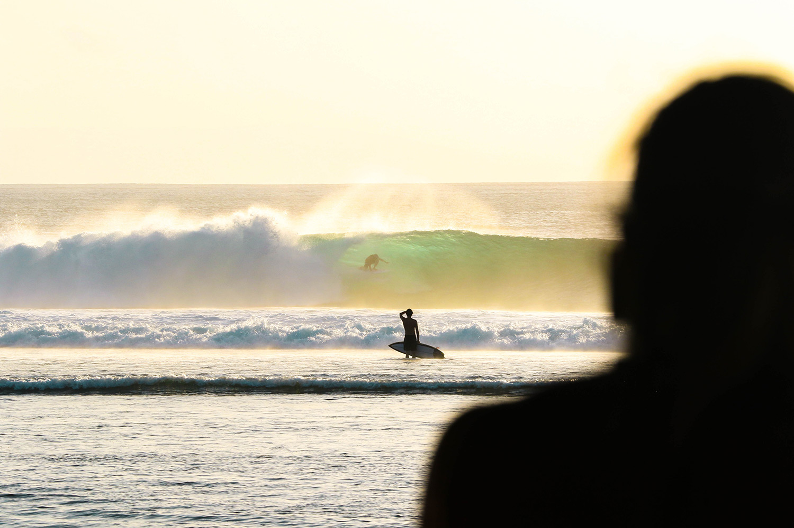
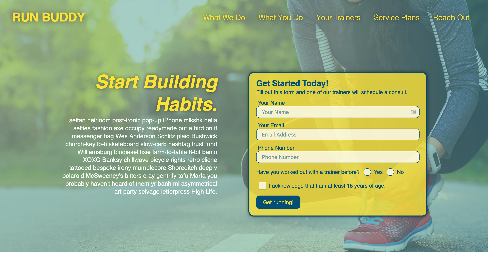

# Sandesh Gurung's Bootstrap Portfolio

Welcome to my Bootstrap-powered portfolio! I'm Sandesh Gurung, and this project showcases my skills in HTML, CSS, and Bootstrap, offering a responsive and visually appealing glimpse into my web development journey.

## Table of Contents

- [Project Overview](#project-overview)
- [Committing Guidelines](#committing-guidelines)
- [Folder Structure](#folder-structure)
- [Bootstrap Implementation](#bootstrap-implementation)
- [Deployment](#deployment)
- [Resources](#helpful-resources)
- [Assets](#assets)

## Project Overview

This portfolio project is a reflection of my dedication to web development. By using Bootstrap, I've structured various sections, including a navigation bar, hero section, work section, skills section, about/contact section, and a footer. The primary aim is to present my skills and projects in a well-organized and visually appealing manner.

## Committing Guidelines

To keep track of my progress and maintain an active repository, I will try commiting early and often. Each commit comes with clear and descriptive messages. My goal is to surpass 200 commits by graduation.

## Folder Structure

Ensuring a clean and organized project, the folder structure includes:

- `css/`: Home to the stylesheet (`style.css`).
- `images/`: A repository for all project images.
- `index.html`: The main HTML file showcasing my portfolio.

## Bootstrap Implementation

Leveraging Bootstrap has allowed me to create the following sections:

1. **Navigation Bar:**
   - Using Bootstrap's navigation menu, I've crafted a custom navbar with relevant links for seamless navigation.

2. **Hero Section:**
   - Bootstrap's jumbotron sets the stage for an engaging introduction, featuring a captivating picture, my name, and additional details.

3. **Work Section:**
   - Projects are presented in a grid using Bootstrap cards, each providing a brief overview and a link to the deployed application.

4. **Skills Section:**
   - This section lists out the skills I'm eager to acquire during the boot camp.

5. **About/Contact Section:**
   - An About Me section provides insights into my journey.

6. **Footer Section:**
   - Hyperlinks exhibit hover effects, and buttons showcase box shadows upon hover.

I've aimed to minimize the use of media queries, ensuring a streamlined Bootstrap solution.

## Deployment

The Bootstrap-powered portfolio is deployed on GitHub Pages. To explore it check link:https://github.com/Sandesh2034/Bootstrap-Portfolio.git or https://sandesh2034.github.io/Bootstrap-Portfolio/ 
## Assets

- )](images/02-hero-bg.jpg)
- ](images/02-portfolio-1.jpg)
- ](images/02-portfolio-2.jpg)
- ](images/02-portfolio-3.jpg)
- ](images/02-portfolio-4.jpg)
- 
- 
- 

## Helpful Resources

- [Bootstrap Documentation](https://getbootstrap.com/docs/5.0/getting-started/introduction/)
- [Responsive Web Design: How to Create Media Queries](https://www.freecodecamp.org/news/css-media-queries-responsive-design-tutorial-for-beginners/)
- [Media Queries 101 by CSS Tricks](https://css-tricks.com/snippets/css/media-queries-for-standard-devices/)
- [Media Query Documentation](https://developer.mozilla.org/en-US/docs/Web/CSS/Media_Queries)
- [GitHub Pages Guide](https://docs.github.com/en/pages/getting-started-with-github-pages/creating-a-github-pages-site)

Feel free to explore my journey through this portfolio. Cheers to the world of web development! 🚀
